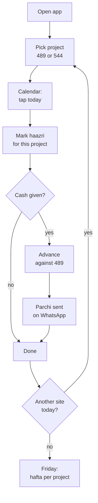

# Roznamcha — Construction Wage & Attendance App Spec

Sep 22, 2026 · @Irfan

Offline-first Android app in Urdu. Multiple projects, a shared worker directory, and a separate wage ledger per worker per project. Owner and munshi enter the data from their own phones and it syncs through Supabase; workers receive their statement on WhatsApp. Expo + React Native, sideloaded APK, fixes shipped over the air with EAS Update.

## The one decision that makes this app work

**Never let anyone type a balance. Derive it.**

The dispute your friend has today — "I don't recall you giving me 5,000" — is not a memory problem. It is an evidence problem. A worker disputes a number because nothing was signed, shown or shared at the moment the cash changed hands. An app that just stores a running total in a box solves nothing: the worker will dispute the box exactly as he disputes the munshi's notebook.

So two rules carry the whole design:

1. **Balance is computed, not stored.** Wages accrue from attendance (days present × daily rate). Advances and payments subtract. The balance is the sum of an append-only list of dated entries, recomputed every time it is shown. Nobody — not even the owner — can edit the number directly.
2. **Every entry produces a receipt the worker receives the same day.** An Urdu parchi image sent on WhatsApp at the moment the cash is handed over, showing date, amount, reason and the new running balance. That is what converts "I don't recall" into "here is the message I sent you on 14 September."

Everything else in this spec — attendance, sites, weekly settlement — exists to feed those two rules.

A corollary worth stating: entries are append-only. A wrong entry is corrected by a reversing entry, not by editing or deleting the original. The moment a munshi can quietly edit last week's advance, the ledger stops being evidence. Show corrections in the timeline as their own line (تصحیح), so the history reads honestly.

## Name: Roznamcha (روزنامچہ)

Decided. It means daybook — the dated record of what happened — which is exactly what this app is, and it carries no collision with any existing app.

The alternatives, kept as a record of what was weighed:

| Name | Urdu | Means | Note |
|---|---|---|---|
| Roznamcha | روزنامچہ | daybook | Chosen. Says "dated record", not "attendance" or "debt" — the broadest and most accurate fit, and distinctive |
| Haazri | حاضری | attendance | Shorter and more familiar, but names only half the app |
| Khata | کھاتہ | ledger | Right in meaning, but KhataBook is a large Indian app — confusing |
| Hisaab | حساب | accounts | Generic; several small apps already use it |
| Mazdoori | مزدوری | wages | Reads as an app about labourers rather than for the site |

One thing to be aware of, since it is the main cost of this choice: roznamcha is four syllables and is also the word for a police station's daily register. Neither is disqualifying — the second association is mild and mostly positive, since it connotes an official record nobody can quietly alter, which is precisely the app's selling point.

Set the launcher label in Urdu — روزنامچہ — with Roznamcha as the Latin fallback. Given the length, check it doesn't truncate under the icon on a small screen; if it does, the launcher label can be روزنامچہ alone while the app's full name lives on the splash and the parchi header.

Optional tagline for the splash or receipt header: حاضری اور حساب ("attendance and accounts") — it does the explaining that the name itself doesn't.

For the icon, a simple open ledger or a ruled page with a dated line reads better than a checkmark now that the name means daybook. Keep it flat, one colour on a dark tile, legible at 48dp on a cheap screen.

## Identifiers — fix these before the first commit

The package id is the one thing you cannot change later without every phone treating it as a different app and losing its data. Decide it now.

Use a namespace you actually control. If your friend's business has no domain, your GitHub handle is the honest, conventional choice:

```
applicationId   io.github.<your-handle>.roznamcha
```

If he does own a domain (say alikhanbuilders.pk), use `pk.alikhanbuilders.roznamcha` instead. Avoid `com.roznamcha.app` and anything under `com.example` — you don't own the first and the second is rejected by Play Console if he ever changes his mind about publishing.

| Field | Value |
|---|---|
| name | Roznamcha |
| slug | roznamcha |
| android.package | io.github.<handle>.roznamcha |
| scheme | roznamcha |
| version | 1.0.0 |
| android.versionCode | 1, incremented on every APK you hand out |
| runtimeVersion | `{ "policy": "fingerprint" }` |
| updates.url | written by `eas update:configure` |
| orientation | portrait |
| userInterfaceStyle | light — skip dark mode in v1, it doubles your RTL testing |
| android.permissions | keep the default list empty and add only what you use |

Two Expo-specific notes:

- Set `extra.eas.projectId` from `eas init` once, and commit it. If you rebuild later from a fresh clone without it, EAS mints a new project and your build history splits.
- Generate the Android keystore on the first EAS build and back it up somewhere your friend's business survives losing your laptop. Lose it and you cannot ship an update that installs over the existing app — every worker has to uninstall and lose their local data. This is the single most common way small sideloaded apps die.

Naming inside the repo: keep every user-facing string out of components and in one `strings.ur.ts` from day one. You will rewrite half of them after the first day on site, and you want that to be one file.

## Data model

Six tables, and the shape of them is driven by one fact: the same worker can be on project 489 and project 544 at once, with a different rate and a separate balance on each. They live in Supabase Postgres and are mirrored into SQLite on each phone by PowerSync (next section), with Drizzle on top — you get typed queries and migrations, which matters because you will add a column after week one. Two more tables for access control are in the backend section.

- **project** — id, code (his own numbering: 489, 544), name_ur, address, started_on, is_active. He already numbers his projects, so make code a first-class, searchable field and show it everywhere.
- **worker** — id, name_ur, father_name (essential — two Muhammad Aslams on one site is the norm), phone, cnic_last4 (optional, for identity only), trade, photo_uri, is_active. Note what is not here: no rate, no project. A worker is a person, and a person outlives any one project.
- **assignment** — id, worker_id, project_id, daily_rate_paisa, started_on, ended_on, is_active. This is the join table that makes the whole thing work. The same Aslam can be on 489 at 1,200/day and on 544 at 1,400/day, and each is its own row. Unique index on (worker_id, project_id, started_on).
- **attendance** — id, assignment_id, date, status (full / half / absent / overtime), overtime_hours, rate_applied_paisa, marked_at. Keyed on the assignment, not the worker, so a day on 489 can never be confused with a day on 544. Unique index on (assignment_id, date) — and note this deliberately allows a worker to be marked present on two projects on the same date, which does happen when a mistri splits his day.
- **ledger_entry** — id, assignment_id, date, kind, amount_paisa, note_ur, created_at, reverses_id (nullable), receipt_sent_at (nullable). Every rupee is attached to a project through the assignment. Append-only.
- **settlement** — id, assignment_id, period_start, period_end, wages_earned_paisa, advances_paisa, paid_paisa, carried_forward_paisa, settled_at. One row per worker per project per hafta.

Three things that will save you pain:

- **Store money as integer paisa, never a float.** 5000.00 in a float becomes 4999.9999 after enough arithmetic, and a wage dispute over one paisa is still a wage dispute.
- **Store the rate on the attendance row, not only on the worker.** When he raises a mazdoor from 1,200 to 1,400 a day, last month's ledger must not silently recompute. Copy rate_applied_paisa onto each attendance row at the moment it is marked.
- **Store dates as YYYY-MM-DD strings, not timestamps.** Attendance is a calendar day, not an instant; timezones will otherwise shift a day's haazri across midnight.

The balance, in one line:

```
balance = Σ_attendance (rate_applied × day factor) − Σ_ledger (advances and payments)
```

— computed per assignment, so every balance in the app is a balance *on a project*. Day factor is 1 for full, 0.5 for half, 0 for absent, plus overtime hours at the agreed hourly rate. Positive balance means the business owes the worker; negative means the worker has drawn more than he has earned.

**The cross-project question, answered.** Money given on 489 belongs to 489 and must never quietly settle against wages earned on 544 — that is how project costing gets destroyed, and your friend needs to know what each project cost him in labour. So every ledger, settlement and parchi is per project.

But the worker does not think in projects; he thinks in one total. So the worker's own profile screen shows a combined view: each project as its own block with its own balance, and a grand total at the bottom. Two numbers, both true, never mixed in the arithmetic. If he ever wants to settle a 489 advance out of 544 wages, make it an explicit transfer — a pair of reversing ledger entries, one on each assignment, with the same reference code linking them. Explicit and traceable; never implicit netting.

## Backend: Supabase, synced with PowerSync

Supabase Postgres is the book of record; each phone keeps a full local SQLite copy and syncs through PowerSync. The app reads and writes locally, so it works with no signal on site, and uploads when a connection comes back.

**Why not call Supabase directly from the app:** construction sites have patchy 4G, and a munshi who can't save an advance because the network dropped will go back to his notebook. Offline-first is not optional for this app.

**Why PowerSync rather than a hand-rolled sync:** it is built for exactly this pairing — it syncs chosen Postgres rows into on-device SQLite, queues local writes, and uploads them through the Supabase client with the user's JWT, so your RLS still applies (PowerSync + Supabase guide). It has a Drizzle driver, so the data model above stays as written. It needs a native module, so you run a dev build rather than Expo Go — which you need for the APK anyway.

**Fallback if PowerSync fights you:** the append-only ledger makes custom sync unusually easy. Entries are never updated, so pushing them is an idempotent insert keyed on a client-generated UUID, and pulling is "everything newer than my last cursor". Only the small mutable tables (project, worker, assignment) need last-write-wins.

**Schema changes for sync.** Every primary key becomes a UUID generated on the phone, never a serial — two phones offline at once will otherwise mint the same id. Every table gains business_id, created_by (the user) and updated_at. Two new tables:

- **business** — id, name. One row for your friend's company. It costs nothing now and lets the app serve a second contractor later without a rewrite.
- **membership** — business_id, user_id, role (owner / munshi).

**Auth.** Email and password for the owner and the munshi, with accounts you create in the Supabase dashboard and public sign-ups switched off. Skip phone OTP: it needs a paid SMS provider and SMS delivery in Pakistan is unreliable. Workers get no accounts in this phase.

**RLS is where the "nobody can edit the ledger" promise becomes real.** In v1 it was only an app convention; now Postgres enforces it.

| Table | Owner | Munshi |
|---|---|---|
| ledger_entry | insert, select | insert, select — no update, no delete, for anyone |
| Reversal entries (reverses_id set) | insert | not allowed — owner approves corrections |
| attendance | insert, update, select | insert, select; update only within 7 days |
| assignment (rates) | full | select only — munshi can't change a wage |
| project, worker | full | insert, select |

Every policy checks business_id against the caller's membership. Add a trigger that copies every attendance update into an audit_log table, so a changed haazri is always visible.

One behaviour to design for: an offline write that RLS later rejects (the munshi tried to change a rate while offline). PowerSync's upload will fail on it. Show those as a "not saved" list on the dashboard rather than silently dropping them.

**Hosting.** Pick the Mumbai region for both Supabase and PowerSync (PowerSync offers India) — it is the closest to Pakistan.

Free-tier limits that matter here (Supabase pricing):

- 500 MB database — decades of wage records for a crew of 50.
- Projects pause after 7 days of low activity (pausing docs). Daily use keeps it awake, but a two-week Eid break or a stalled project will pause it, and the phones then stop syncing until someone presses Resume in the dashboard. They keep working offline in the meantime.
- No daily backups on Free. Daily backups with 7-day retention start on Pro at $25/month.

My recommendation: start on Free, and move to Pro the week your friend stops keeping the paper notebook. At that point this database is his wage record, and $25 a month is cheap insurance against losing it.

## Screens and the daily flow

Everything hangs off a project picker. The munshi picks project 489 once when he arrives on site, and from then on every screen, every entry and every total is scoped to 489 until he switches. Show the project code in the header at all times — the worst bug this app can have is an advance recorded against the wrong project.

| Screen | Scope | What it does |
|---|---|---|
| Projects | — | List of projects by code and name, each with headline outstanding and worker count. Add / edit / archive. Tapping one sets the active project |
| Dashboard | Project | Today's haazri marked or not, total outstanding on this project, two big buttons: mark attendance, give advance |
| Workers on project | Project | Assigned workers with balance chips. "Add worker" opens the global directory first, so an existing person is reused rather than duplicated |
| Worker directory | Global | Full CRUD on people: name, father's name, phone, trade, photo. Shows which projects each is on |
| Worker detail | Both | Per-project blocks each with its own ledger and balance, then a grand total. Share statement per project or combined |
| Mark attendance | Project | Calendar month view; tap a date to open that day's worker list; tap a row to cycle present → half → absent. Dots on the calendar show marked, partly marked and unmarked days |
| New entry | Project | Advance or payment against this project's assignment. Sends the parchi on save |
| Hafta settlement | Project | Per worker for the week: earned, advances, net payable, paid, carry-forward |
| Settings | — | Backup, PIN, trades, export |

**Adding a worker to a project is two steps, and the order matters.** Search the global directory by name or phone first; if he already exists, you create only an assignment with a rate for this project. Only if he is genuinely new do you create the person. Get this backwards and within a month your friend has three Muhammad Aslams and no idea which one owes him money. Make the duplicate check aggressive — warn on the same phone, and on the same name plus father's name.

**The calendar is the right shape for attendance here.** A month grid answers the question the owner actually asks — was haazri marked every day last week? — in one glance, and gaps show up instead of silently not existing. Tap a date, get that date's worker list, mark, save. Keep the flat list as the inner screen, not the entry point.

The daily flow:



Design notes that matter more than they sound:

- The attendance row must be at least 64dp tall with the worker's name in 20sp. A munshi in bright sunlight with dusty hands does not hit 44dp targets.
- Default every worker to present. Absence is the exception. Opening the screen pre-marked present and only tapping the absentees turns a two-minute job into a fifteen-second one.
- Colour the balance chip from the business's point of view and label it in words. Green with "ہمارے ذمے" (we owe) versus red with "وصول طلب" (recoverable). Never show a bare minus sign; sign conventions are exactly what people argue about.
- Block back-dating beyond seven days behind a confirmation. The audit value of the ledger comes from entries being made on the day.

**The hafta settlement screen is the one your friend will actually love.** Construction wages in Pakistan settle weekly, and the whole argument happens on payday. Showing him earned 8,400, advanced 5,000, pay 3,400 with the underlying days listed is the product.

## The parchi — WhatsApp receipt

This is the feature that solves the actual problem, and it is why you do not need workers to install anything.

When the munshi saves an advance, the app renders a small Urdu receipt as an image and opens WhatsApp with it pre-attached to that worker's number. He taps send. The worker now has a timestamped message on his own phone, in his own language, that he cannot claim not to have received.

**Why an image and not text:** a photo survives forwarding, screenshots cleanly, is readable by someone who reads Urdu slowly, and cannot be mistaken for a scam message. Send a one-line text alongside it for people who prefer text.

What goes on the parchi, in this order and nothing more:

- Business name at the top
- Worker's name, large
- Date in Urdu
- The amount, largest thing on the slip
- Reason (پیشگی / ادائیگی / جرمانہ)
- New running balance, and whether it is owed to him or by him — in words
- A short reference code (R-2026-0412) so a disputed slip can be found in the app instantly

**How to build it:** render a hidden React view and capture it with react-native-view-shot, then hand the resulting file to expo-sharing. That keeps the receipt styled with the same components as the rest of the app, and you avoid the pain of canvas or PDF text shaping with Nastaliq. Cache the PNG next to the ledger entry and stamp receipt_sent_at.

The weekly statement is the same mechanism with more rows: the week's days present, total earned, advances taken, amount paid, carry-forward. Send it every Friday from the settlement screen.

One behavioural detail worth insisting on with your friend: **the parchi must be sent in front of the worker, before the cash leaves the hand.** A receipt sent that evening is evidence; a receipt sent in the moment is agreement. It changes the dispute from "prove it" to "you saw it".

**On WhatsApp deep-linking from Expo:** `https://wa.me/92XXXXXXXXXX?text=...` opens a chat with text but cannot attach an image. So use expo-sharing's share sheet with the image and let the munshi pick the contact — one extra tap, and it works on every phone without any WhatsApp Business API setup. If it becomes a friction point later, WhatsApp Cloud API can send templated receipts automatically, and with Supabase in place that's now just an Edge Function triggered on each new ledger entry. It still needs Meta business verification and costs per message, so keep it for later.

## Urdu and RTL in Expo — what actually bites

Force RTL once at startup and never support LTR. A single-language app is far easier than a bilingual one, and your users are all Urdu readers.

In Expo this is build-time config, not runtime code. Add the expo-localization config plugin with `forcesRTL` (Expo localization guide):

```json
{
  "expo": {
    "plugins": [
      ["expo-localization", { "forcesRTL": true }]
    ]
  }
}
```

The app is then born RTL on every launch — no `I18nManager.forceRTL()` call and no first-launch restart flash. Because it is native config, changing it needs a new APK, not an OTA update. Set it on day one and never touch it again.

The specific traps, in the order you will hit them:

| Trap | Fix |
|---|---|
| left / right in styles don't flip | Use start / end everywhere: marginStart, paddingEnd, textAlign: 'start' |
| Icons point the wrong way | Back chevrons, arrows and progress icons need `transform: [{ scaleX: -1 }]`; logos and checkmarks must not |
| Amount fields render backwards while typing | Force LTR on numeric TextInputs: `writingDirection: 'ltr'`, `textAlign: 'right'` |
| Mixed Urdu + digits in one string jumbles | Wrap runs with Unicode marks (U+200F RLM) or, better, put digits in their own `<Text>` |
| flexDirection: 'row' already flips | So don't also reverse your arrays — this double-flip bug costs everyone an afternoon |
| Shadows and gradients don't flip | Check any directional shadow offset by hand |

**Fonts.** Jameel Noori Nastaleeq is what Pakistanis expect, but Nastaliq is a nightmare at small sizes: it needs huge line heights, clips descenders in fixed-height rows, and renders inconsistently across Android versions. My recommendation: Noto Nastaliq Urdu for the app title and the parchi header only; Noto Naskh Arabic for every label, row and number in the UI. Naskh is what people read on signage and forms, it is far more legible at 16sp, and it does not break your layouts. Load both with expo-font.

**Digits.** Use Latin digits (1234) for all money and dates, not Urdu-Indic (۱۲۳۴). Everyone handling cash in Pakistan reads Latin numerals fluently — they are on every currency note and price tag — and they eliminate an entire class of OCR, copy-paste and font-fallback bugs. Keep the labels in Urdu.

Format amounts with thousands separators and the word روپے after them: 5,000 روپے. Do not use the ₨ symbol; it renders as a tofu box on plenty of cheap Android phones.

Last one: test on a real low-end Android phone running Urdu as the system language, not on a simulator. Nastaliq rendering, font fallback and RTL gesture handling all differ, and the phones your friend's workers carry are the ones that will surface it.

## Urdu label glossary

Drop this straight into `strings.ur.ts`. These are the words site workers actually use, not textbook Urdu — which matters, because the app has to be readable by someone who left school at twelve.

| Key | Urdu | English |
|---|---|---|
| app.name | روزنامچہ | Roznamcha |
| nav.home | ہوم | Home |
| nav.workers | مزدور | Workers |
| nav.attendance | حاضری | Attendance |
| nav.settings | ترتیبات | Settings |
| worker.name | نام | Name |
| worker.phone | موبائل نمبر | Mobile number |
| worker.rate | دیہاڑی | Daily wage |
| worker.trade | کام | Trade |
| trade.mason | مستری | Mason |
| trade.labourer | مزدور | Labourer |
| site | سائٹ | Site |
| att.present | حاضر | Present |
| att.half | آدھا دن | Half day |
| att.absent | غیر حاضر | Absent |
| att.overtime | اوور ٹائم | Overtime |
| entry.advance | پیشگی | Advance |
| entry.payment | ادائیگی | Payment |
| entry.deduction | کٹوتی | Deduction |
| entry.bonus | انعام | Bonus |
| entry.correction | تصحیح | Correction |
| ledger | کھاتہ | Ledger |
| balance.owed_to_worker | ہمارے ذمے | We owe |
| balance.owed_by_worker | وصول طلب | Recoverable |
| balance.total | کل بقایا | Total outstanding |
| earned | کمائی | Earned |
| settlement | ہفتہ بندی | Weekly settlement |
| carry_forward | اگلے ہفتے میں | Carried forward |
| receipt | پرچی | Receipt |
| action.save | محفوظ کریں | Save |
| action.send | بھیجیں | Send |
| action.share | شیئر کریں | Share |
| action.add_worker | نیا مزدور | Add worker |
| date.today | آج | Today |
| date.yesterday | کل | Yesterday |
| backup | بیک اپ | Backup |

One caution: کل means both yesterday and tomorrow in Urdu. In a wage app that ambiguity is dangerous — always show the actual date beside it, never the relative word alone.

Have your friend read the list out loud before you build. Wage vocabulary is regional; a crew in Lahore and a crew in Karachi will not use the same word for a deduction, and using the wrong one quietly erodes trust in the whole app.

## Backup, PIN, and surviving a broken phone

With Supabase, a phone dropped in wet cement costs nothing: sign in on a new phone and PowerSync pulls the full history back down. The risks move to three new places.

**Unsynced writes on a lost phone.** An advance entered offline and never uploaded dies with the phone. Show a sync status in the header at all times — a green tick when everything is uploaded, an amber count of pending entries when not. Tell the munshi the rule: don't hand over cash for the day's last advance without seeing the tick go green at some point that evening.

**The database itself.** Supabase Free has no daily backups and pauses after a week of inactivity (see the backend section). Until you move to Pro, run a weekly export: a scheduled Edge Function or GitHub Action that dumps the tables to CSV and emails them to your friend. Twenty minutes to set up, and it's the only copy that doesn't depend on Supabase.

**Restore must be tested before you ship.** Install on a second phone, sign in as the munshi, and check that every project, worker and balance matches. An untested restore is not a backup.

**Two phones, one truth — solved.** The owner and the munshi can now both enter data. Conflicts are rare by design: the ledger is insert-only, so two phones can't overwrite each other's entries. The one real conflict is two people marking the same worker's haazri on the same day differently. Upload attendance as an upsert on (assignment_id, date) in PowerSync's uploadData, so the later write wins instead of failing on the unique index, and the audit trigger keeps the earlier value.

**PIN lock.** A 4-digit PIN on cold start, stored hashed in expo-secure-store. Not for hackers — for the ordinary situation where the munshi's phone is in someone else's hands for a minute. Skip biometrics; cheap Android fingerprint sensors fail with cement-dusted hands.

One thing to be careful about, since this is a wage record: Pakistan's Payment of Wages Act limits what can be deducted from a worker's wages and requires that deductions be recorded. An app that makes advances and deductions more transparent is on the right side of that, but avoid building features that automate open-ended deductions or let a balance run indefinitely negative. Keeping the worker's copy of the record equal to the owner's is both the ethical design and the one that prevents the disputes your friend is trying to avoid. I'm not a lawyer — worth him checking if he ever formalises this beyond his own crew.

## Distribution and over-the-air updates

Share the APK once; ship almost every fix after that with EAS Update. OTA updates come from Expo's servers, not Google Play, so they work the same on a sideloaded APK.

**The APK.** Build with `eas build -p android --profile production` and set `"buildType": "apk"` in that profile. The default is an AAB, which Play Store needs and a phone can't install directly — this catches almost everyone the first time. EAS gives you a download link to send on WhatsApp.

**OTA setup, once:**

1. `npx expo install expo-updates`, then `eas update:configure` — this writes updates.url into app.json.
2. Set `"runtimeVersion": { "policy": "fingerprint" }`. Expo recommends it as the safest policy: the runtime version changes whenever anything native changes, so an update can never reach an APK that can't run it (runtime versions).
3. Give each build profile in eas.json a channel: `"channel": "production"` on the one you ship, `"channel": "preview"` on a test build for your own phone.
4. Ship a fix: `eas update --channel preview --message "..."`, check it on your phone, then the same with `--channel production`.

By default the app checks for an update on launch, downloads it in the background and applies it on the next cold start. For a wage app that's fine. Add a small "new version ready — restart" banner using the `useUpdates()` hook, so a fix you ship at noon is running by the afternoon instead of tomorrow.

What OTA can and can't ship:

| Ships over the air | Needs a new APK |
|---|---|
| Screens, logic, Urdu strings, styles | Adding or upgrading any native library |
| Balance formula, settlement rules | Expo SDK upgrades |
| Bundled images and fonts | Changes to app.json native config: permissions, icon, package, the RTL plugin |
| Bug fixes in sync handling | Changing PowerSync or SQLite driver versions |

**When you do need a new APK.** Put a one-row app_config table in Supabase with min_supported_version and latest_apk_url. On launch the app compares its own version; if it's below the minimum, show a full-screen Urdu message with a download button. That replaces the GitHub Releases check — you already have a backend, so use it. Always sign with the same keystore: `eas credentials` lets you download a backup, and losing it means every phone must uninstall and reinstall.

**Rolling back.** If an update breaks something, republish the previous one with `eas update:republish` or from the update history in the EAS dashboard. Phones pick it up on their next launch.

Limits (Expo pricing): the free plan includes 15 Android builds a month and 1,000 monthly active users for EAS Update. With two or three phones in this phase, you won't come close.

Two warnings to give your friend once, on a call: Android will ask him to allow installs from unknown sources, and Play Protect may show a warning. Both are one-time per phone. Add Sentry as well — you won't be able to reproduce a crash that happens on a site an hour away.

## Build order

You said you are in a hurry, so here is the order that gets something on your friend's phone fastest without painting you into a corner.

**Week one — the thing that must exist.**

1. Expo dev build with the RTL plugin, fonts, expo-updates configured, and one Urdu screen rendering on a real phone. If RTL or the build pipeline is going to fight you, find out on day one.
2. Supabase project in Mumbai: all tables with UUID keys, business + membership, RLS policies, the audit trigger, and two user accounts. Write this as SQL migrations with the Supabase CLI, not by clicking in the dashboard.
3. PowerSync instance, sync rules scoped by business_id, and the connector in the app. Prove an entry made in airplane mode reaches Postgres when the phone goes back online.
4. Projects CRUD and the project picker.
5. Worker directory CRUD + assignment to a project with a rate.
6. New entry (advance / payment) and the per-project ledger on worker detail.
7. The parchi. Ship nothing to your friend before this exists — it is the whole reason the app is being built.

That is a usable product. He can start recording advances immediately, which is the bleeding wound.

**Week two — what makes it stick.**

8. Calendar attendance and bulk marking.
9. Derived balances from attendance (until now, balance is just advances minus payments).
10. Hafta settlement screen and weekly statement.
11. Sync status indicator, the "not saved" list for rejected uploads, and the app_config minimum-version check.
12. Weekly CSV export, PIN lock, Sentry, the restart-for-update banner.

**Later, only if he asks.**

13. Combined cross-project statement and explicit transfers between assignments.
14. Per-project labour cost reporting — nearly free once the data is in Postgres; a SQL view and a screen.
15. Worker logins with read-only access to their own balance. The schema and RLS already support it: add a worker_user link and one select policy.
16. Automatic parchi delivery via the WhatsApp Cloud API from an Edge Function.

Two cuts worth making deliberately in v1: no photo capture of workers (nice, but it doubles your storage and backup size), and no dark mode.

One piece of advice on sequencing, since it is his business and not a side project: get him using it on one project before you add the second. Multi-project is in the schema from day one so you never have to migrate, but the second project should only appear in the UI after a week of real use on the first. Every wrong assumption in this spec will surface in that week, and it is much cheaper to fix with one project's worth of data in the database.

## Settle these with your friend before you code

Ten minutes on the phone with him now saves a week of rework. These are the questions where I had to guess, and where guessing wrong is expensive.

- [x] Does a worker's rate ever differ by project? I have assumed yes and put the rate on the assignment. If it never varies, the model still works — but confirm, because the reverse is a painful migration.
- [ ] What happens when a worker splits one day across two projects? The schema allows marking him present on both. Should that pay him two full days, or half on each? Ask how he actually pays this today.
- [ ] Weekly or fortnightly settlement? I have assumed hafta. If he settles on the 1st and 15th, the settlement period logic changes.
- [ ] How is overtime priced? Daily rate ÷ 8, or a negotiated hourly figure, or a flat per-hour amount across all workers?
- [ ] Do advances ever carry a deduction schedule — "5,000 now, cut 1,000 a week for five weeks"? If yes, that is a real feature and not a note field, and it should go in week two.
- [ ] Is there a contractor or thekedar layer? If he pays a thekedar who pays the crew, the whole model shifts up a level and workers may not need individual ledgers at all. This is the question most likely to invalidate the design above, so ask it first.
- [ ] Who holds the phone — him or a munshi? It changes the trust model, whether you need an audit trail of who marked what, and how hard you push the PIN.
- [ ] Do all workers actually have WhatsApp, or just a phone? If a meaningful share don't, the parchi needs a printed or photographed fallback, and that changes the receipt design.
- [ ] Does he want to see what a project cost him in labour? If yes, say so now — it is nearly free given this schema, and it is the feature that makes him keep using the app after the advance problem is solved.
- [ ] Will he pay $25 a month for Supabase Pro once the app replaces the notebook? It buys daily backups and no pausing. If not, the weekly CSV export stops being a stopgap and becomes the real backup.
- [ ] Who owns the Supabase, PowerSync and Expo accounts? Create them under an email your friend controls, with you added as a member. If they sit under your personal account, his business records depend on you.

My honest read: the thekedar question and the split-day question are the two that could send you back to the drawing board. Ask those two before you write a line of code; the rest can be answered while you build.
